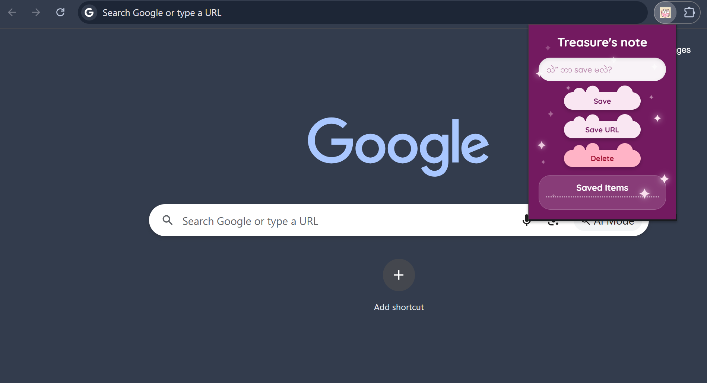

# Treasure's Note

Treasure's Note is a simple Chrome Extension built with JavaScript.

I created this project for my friend who was struggling to save notes and useful links while working in Chrome.

The extension allows users to:
- Save custom notes or links
- Save the current browser tab instantly
- Store data using localStorage
- Keep saved items even after refreshing Chrome
- Quickly open saved links in a new tab

---

# Features

## Save Input
Users can type notes or URLs and save them.

## Save Current Tab
Users can save the current Chrome tab with one click.

## Persistent Storage
Saved items are stored using localStorage.

## Delete Saved Items
Users can remove saved items from the list.

---

# Technologies Used

- HTML
- CSS
- JavaScript
- Chrome Extension Manifest V3
- localStorage API
- Chrome Tabs API
- Vite

---

# Project Structure


project-folder/
│
├── manifest.json
├── index.html
├── index.js
├── style.css
├── icon.png
├── package.json
├── vite.config.js
│
├── preview/
│   ├── preview1.png
│   ├── preview2.png
│   └── demo.gif
│
└── README.md


---

# Preview

## Main Interface



## Saved Notes & Tabs


---
# How to Run

1. Download or clone the project

2. Open Chrome and go to:

```text
chrome://extensions/
```

3. Enable Developer Mode

4. Click "Load unpacked"

5. Select the project folder

6. The extension will appear in your Chrome toolbar

---

# Author

Made by [Peter Paing] 